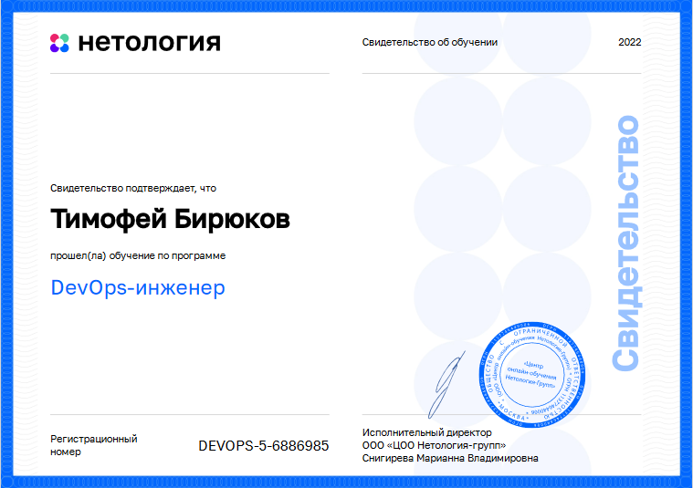

# БИРЮКОВ ТИМОФЕЙ   
<table border="0">
  <tr>
    <td  width="700" align="right">
         
+7 926 340-4678    
biryukov_tv@mail.ru     
Телеграм https://t.me/dev0ops     
    </td>
    <td width="200"  align="center">

    </td>
  </tr>
<table>

*DevOps-инженер, системный администратор с большим опытом работы и глубоким пониманием полного стека проблем и технологий ИТ-сферы. Люблю и с успехом занимаюсь автоматизацией рабочих процессов в компаниях.*
  
# Некоторые проекты и наработки
- [Выполненные работы по курсу Нетологии DevOps-инженер.](https://github.com/Dok-dev/devops-netology)    
- [Скрипт мониторинга роста открытых на запись файлов полицейской записи](https://github.com/Dok-dev/CamsChecker)    
- [UDP клиент-сервер для проверки качества каналов связи](https://github.com/Dok-dev/UDP-client-server)    
- [Роль Ansible Nginx+TLS](https://github.com/Dok-dev/ocrv/tree/main/roles/nginx) для развертывания стека [Nginx, PHP, MySQL, Redis](https://github.com/Dok-dev/ocrv) в различных ОС    
- [Скрипт проверки состояния устройства и перезагрузки](https://github.com/Dok-dev/TelnetRobot)    
- [Скрипт проверки места на сетевых хранилищах разных вендоров](https://github.com/Dok-dev/Scripting/tree/main/Python/storage-report)
- [Скрипт проведения инвентаризации инфраструктуры в сегменте сети с Windows](https://github.com/Dok-dev/Scripting/tree/main/PowerShell%26WMI/Inventorysation)
- [Плагин для коммерческого сервера на Java](https://github.com/Dok-dev/Regenerator)    
  
# Тестовые задания с собеседований    
- [9 задач из разных областей](https://github.com/Dok-dev/mts)    
- [Плейбук Ansible для кластера MySQL+Redis+PHP+Nginx под несколько ОС](https://github.com/Dok-dev/ocrv)    
- [Скрипт для парсинга логов](https://github.com/Dok-dev/per_minute_parcer)    
  
# Диплом о профессиональной переподготовке    
    
    
    
  
# Сертификаты
Стажировка в Open Solutions

[Операционные системы](https://gb.ru/certificates/1038904.en)    
    

[Базы данных для профессионалов и язык SQL](https://gb.ru/certificates/561250.en)   
    

[Linux Intermediate](https://gb.ru/certificates/1042547.en)   
    

[Computer networks Middle level](https://gb.ru/certificates/548850.en)   
    

[Python](https://gb.ru/certificates/1041485.en)   
    

[Java](https://gb.ru/certificates/548878.en)   
    

[Основы сетей и сетевых операционных систем - Эксперт](http://www.specialist.ru/testrun/result/2912063)   
    

[Английский B1](https://gb.ru/certificates/1041073.en)   
    

# Контакты
 +7 926 340-4678   
biryukov_tv@mail.ru    
Телеграм https://t.me/dev0ops    
